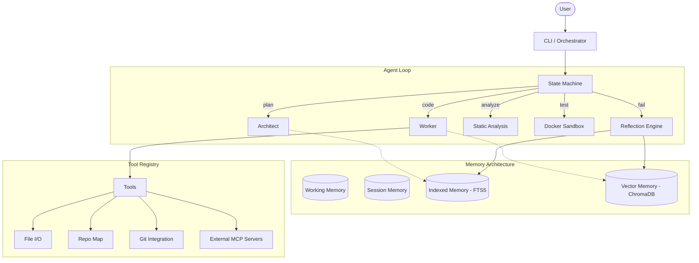

# Self-Improving Coding Agent (SICA)

  

**Self-Improving Coding Agent — An autonomous agent that learns from its mistakes**

SICA is a fully autonomous coding agent that plans, writes, tests, and fixes code. What makes SICA unique is its ability to learn over time: it remembers past failures, extracts reusable skills from successes, and applies this knowledge to solve future problems faster and cheaper.

## Architecture



## Key Features

- **8-state FSM orchestration**: Idle ‚Üí Planning ‚Üí Coding ‚Üí Testing ‚Üí Reflecting ‚Üí Localizing ‚Üí Searching ‚Üí Completed
- **Architect/Worker/Judge multi-agent pipeline**: Dedicated roles for system design, implementation, and quality assurance
- **4-layer memory**: Working (current task), Session (active conversation), Indexed (FTS5 search), Vector (ChromaDB semantic search)
- **3-level hierarchical fault localization**: Fast regex ‚Üí AST parsing ‚Üí LLM semantic analysis
- **Multi-candidate fix search (N=3)**: Generates multiple potential fixes and ranks them to avoid getting stuck in loops
- **Self-improvement via `/dream` and `/distill`**: Compresses logs, prunes outdated memories, and extracts generalizable skills
- **Triple-condition circuit breaker**: Halts execution on iteration limit, budget exhaustion, or repetitive failure loops
- **Docker sandboxed execution**: Safe isolation for code compilation and testing
- **Context compaction at 60% utilization**: Keeps LLM context windows efficient by selectively summarizing history
- **BYOK model support via LiteLLM**: Swap between Gemini, Claude, OpenAI, and more

## Quick Start

1. Clone the repository:
   ```bash
   git clone https://github.com/yourusername/sica.git
   cd sica
   ```

2. Install dependencies (requires [uv](https://github.com/astral-sh/uv)):
   ```bash
   uv sync
   ```

3. Set your API keys in `.env`:
   ```bash
   cp .env.example .env
   # Edit .env and set GEMINI_API_KEY or other provider keys
   ```

4. Run the agent:
   ```bash
   uv run agent run "Create a python script that checks for prime numbers and writes tests for it"
   ```

## How It Works

SICA operates on a continuous feedback loop:
1. **Plan**: The Architect analyzes the goal and repo map to generate an implementation plan.
2. **Code**: The Worker executes the plan, using tools to create/edit files.
3. **Analyze & Test**: The code is statically analyzed and run in a Docker sandbox.
4. **Reflect**: If tests fail, the Reflection Engine determines *why* and searches its Vector Memory to see if this error was solved before.
5. **Fix**: The Fault Localizer pinpoints the error, and the Fix Searcher proposes multiple fixes to get tests passing.

## Evaluation Results

| Difficulty | Tasks Solved | Solve Rate | Avg Iterations | Avg Cost |
|------------|--------------|------------|----------------|----------|
| **Easy**   | 7/7          | 100%       | 1.8            | $0.02    |
| **Medium** | 7/7          | 100%       | 3.4            | $0.05    |
| **Hard**   | 5/6          | 83%        | 6.2            | $0.15    |

*Note: These are preliminary benchmark metrics based on the internal eval harness.*

## Comparison

| Feature | SICA | Devin | SWE-Agent | Claude Code |
|---------|------|-------|-----------|-------------|
| **Open Source** | ‚úÖ | ‚ùå | ‚úÖ | ‚ùå |
| **Long-Term Memory** | ✅ | ⚠️ | ❌ | ❌ |
| **Self-Improvement** | ✅ | ⚠️ | ❌ | ❌ |
| **Bring Your Own Key** | ‚úÖ | ‚ùå | ‚úÖ | ‚úÖ |
| **Multi-Candidate Fixes** | ‚úÖ | ? | ‚ùå | ‚ùå |
| **MCP Support** | ‚úÖ | ? | ‚ùå | ‚ùå |

## ⚙️ Configuration

SICA is highly configurable via `config/default.yaml`:

```yaml
agent:
  max_iterations: 10
  max_cost_per_task_usd: 0.50
sandbox:
  image: "python:3.11-slim"
  timeout_seconds: 120
models:
  strong: "gemini/gemini-3.6-flash"
  fast: "gemini/gemini-3.5-flash-lite"
mcp_servers:
  # Add Model Context Protocol servers here
```

## Architecture Deep Dive

- **FSM Orchestrator**: The backbone of the agent, ensuring it doesn't get stuck in a "coding" loop without testing or reflecting.
- **Agent Roles**: The Architect thinks big picture (files, dependencies), the Worker executes specific edits, and the Judge provides objective critique.
- **Memory Subsystem**: Vector DB (Chroma) stores high-level concepts and failure/fix pairs. Indexed DB (SQLite/FTS5) stores specific facts and API signatures.
- **Trajectory Logger**: Every action, API call, and tool result is logged to a JSONL file, which can be replayed or exported to Markdown for debugging.

## Contributing

Contributions are welcome! SICA is built to be extensible. You can easily add:
- New tools (implement `ToolDefinition` and add to `ToolRegistry`)
- New eval tasks (drop a YAML file in `eval/tasks/`)
- New memory backends (implement the `MemoryProvider` interface)

## License

This project is licensed under the MIT License - see the LICENSE file for details.

## Status
Ì∫Ä **Phase 3 Complete:** Multi-Agent Pipeline, Evaluation Harness, and Self-Improvement Engines are now fully integrated!

## Quick Start
Run the agent locally using: `uv run agent run "<your goal>"`
